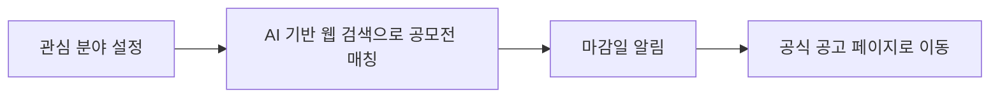
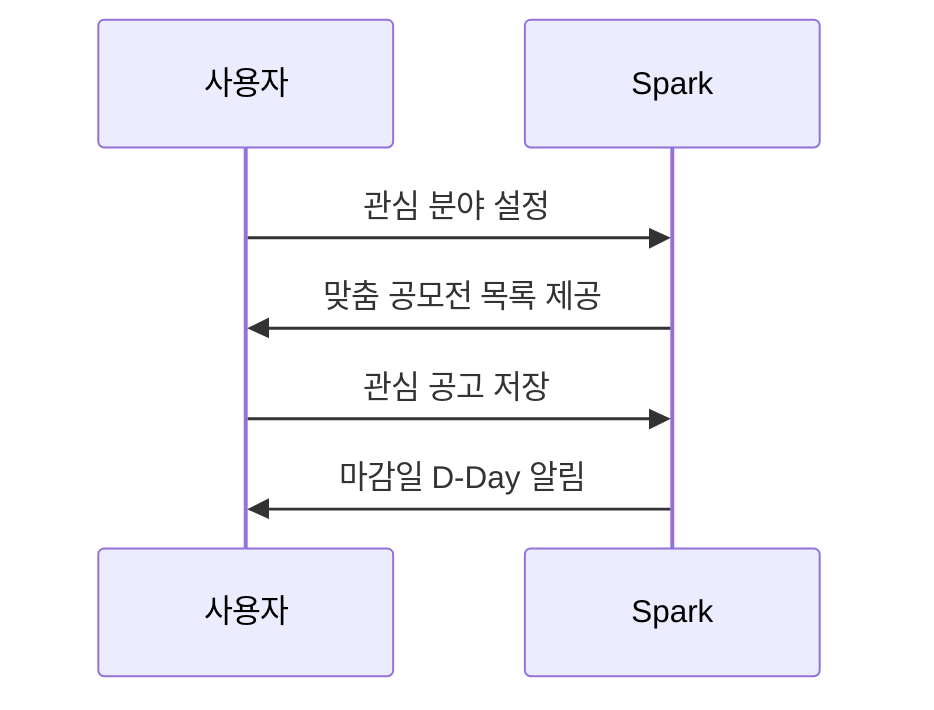

# Spark — 국내 공모전 정보 & 맞춤 알림

- App Store: [apps.apple.com](https://apps.apple.com/app/id6782085427)
- Google Play: [play.google.com](https://play.google.com/store/apps/details?id=com.contest.alarm&hl=ko)
- 개인정보처리방침: [spark.sanglimsoft.com/privacy](https://spark.sanglimsoft.com/privacy/)
- 고객지원: [spark.sanglimsoft.com/support](https://spark.sanglimsoft.com/support/)

**Spark**는 여기저기 흩어진 국내 공모전·대외활동 공고를 한곳에 모아, 관심사에 맞는 공고만 골라 마감일을 놓치지 않도록 알려주는 서비스입니다.

## 어떻게 동작하나요

### 이용 흐름

## 이런 분께 추천합니다

- 포트폴리오에 넣을 공모전을 꾸준히 찾는 대학생·취준생
- 사이드 프로젝트·대외활동 기회를 놓치기 싫은 직장인
- 디자인·영상·글쓰기 등 분야별 공모전을 정기적으로 확인하는 창작자

## 주요 기능

- 관심 분야에 맞춘 공모전 큐레이션
- 저장한 공고의 마감일 알림
- 공식 공고 페이지로 바로 연결
